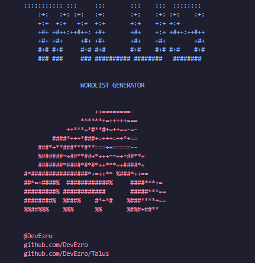

# TALUS - WORDLIST GENERATOR (in progress)

>[!CAUTION]
For educational purposes only  
I do not get responsable of any damage this tool can triger

>[!WARNING]
FOR YOUR WELL, DO NOT USE REAL INFO TO AVOID POSSIBLE ATACKS

## USAGE
`python talus.py`

# To do
- Check characters error -> ¿
- Compare introduced data with data type
- Add file path
- Refactor GUI